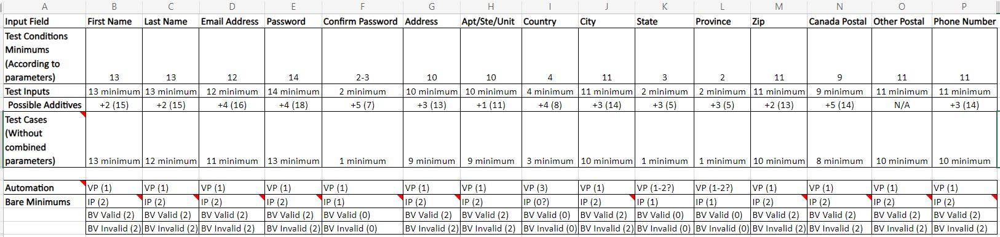

# Organizing and Assesing Work
Before you can do any work you have to identify the work. You were provided with an excel workbook to create the test conditions, input values, and test cases and a word document with requirements for the webpage form you will be testing. There are four worksheets in the excel workbook, three worksheets will require you to fill them out: 

- Conditions Table
- Condition Input Values
- Registration Test Cases

Aside from completing these worksheets, you will have to develop the automation of test cases. You are not expected to automate all test cases. However, a certain amount of test  cases will have to be developed. 

I suggest you first try to list what needs to be done. Have everyone in your team write down the tasks that need to get done. EVERYTHING they can think of is valid at this stage. You can look at the excel sheet and think about the previous exercises you did for WebdriverIO to come up with a list of tasks. 
